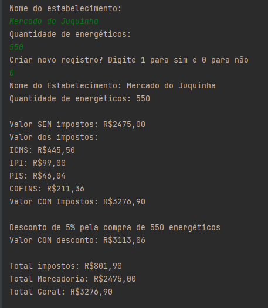
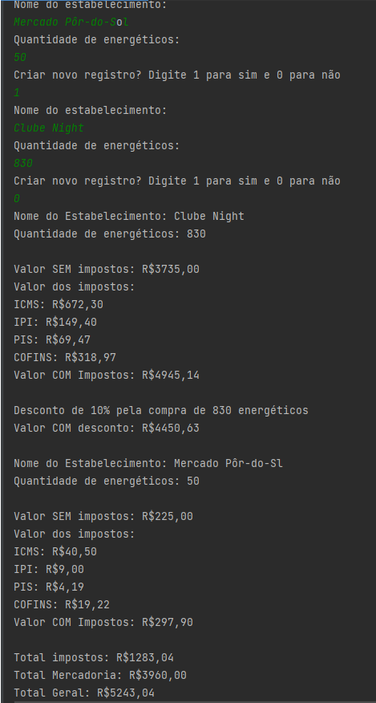

<h1>Exercício de programação</h1>

Este programa foi criado como solução para o exercício de programação Energéticos Accelerator do processo seletivo da Acceleradora Ágil. 

<h1>Descrição do desafio</h1>

Criar uma aplicação que realize o cálculo de impostos referente as vendas realizadas.

<h1> IDE e tecnologia utilizada </h1>

A elaboração deste desafio foi feita na IDE Intellij utilizando Java.

<h1>Resolução do desafio</h1>

Para resolução do desafio foi criada uma única classe que contém 3 métodos, sendo eles calculoImpostos, totalGeral e relatorioImpostos descritos a seguir:

calculoImpostos: nele é onde será realizado os cálculos de impostos em relação a quantidade de energéticos comprados de forma indívidual para cada comprador;

totalGeral: realiza o cálculo geral quanto ao valor total em impostos, em mercadoria e gereal, nesse método o cálculo realizado tem como base a quantidade total de energéticos comprados para todos os estabelecimentos inseridos;

relatorioImpostos: este é o método principal a ser chamado, nele constam incluidos os métodos anteriormente descritos, nele é onde será informado o nome do estabelecimento e a quantidade de compra de cada e também irá 

Questão bônus: como meio de bonificação/desconto foram inseridas cláusulas no método calculoImpostos, onde descontos são aplicados de acordo com a quantidade de energéticos comprados.

Execução para um estabelecimento:

Execução para mais de um estabelecimento:

